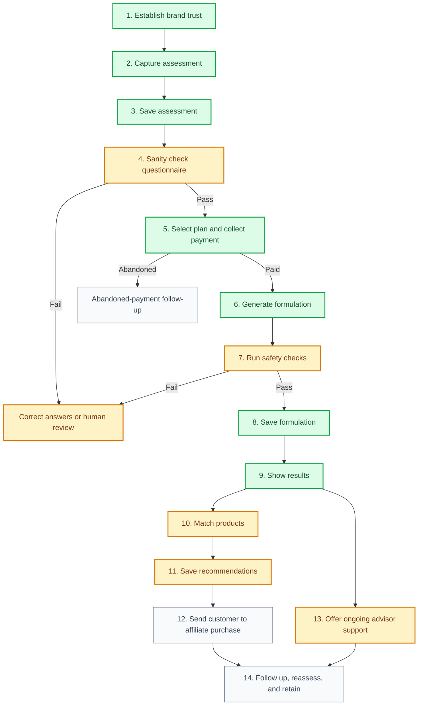
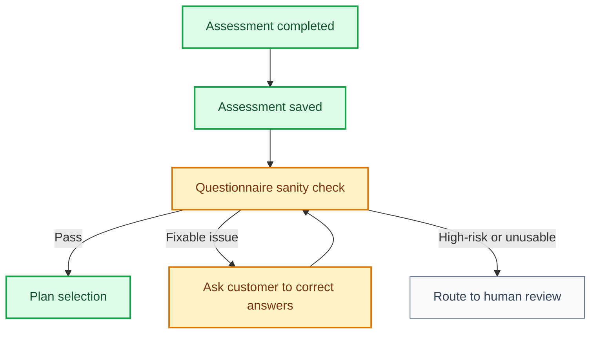
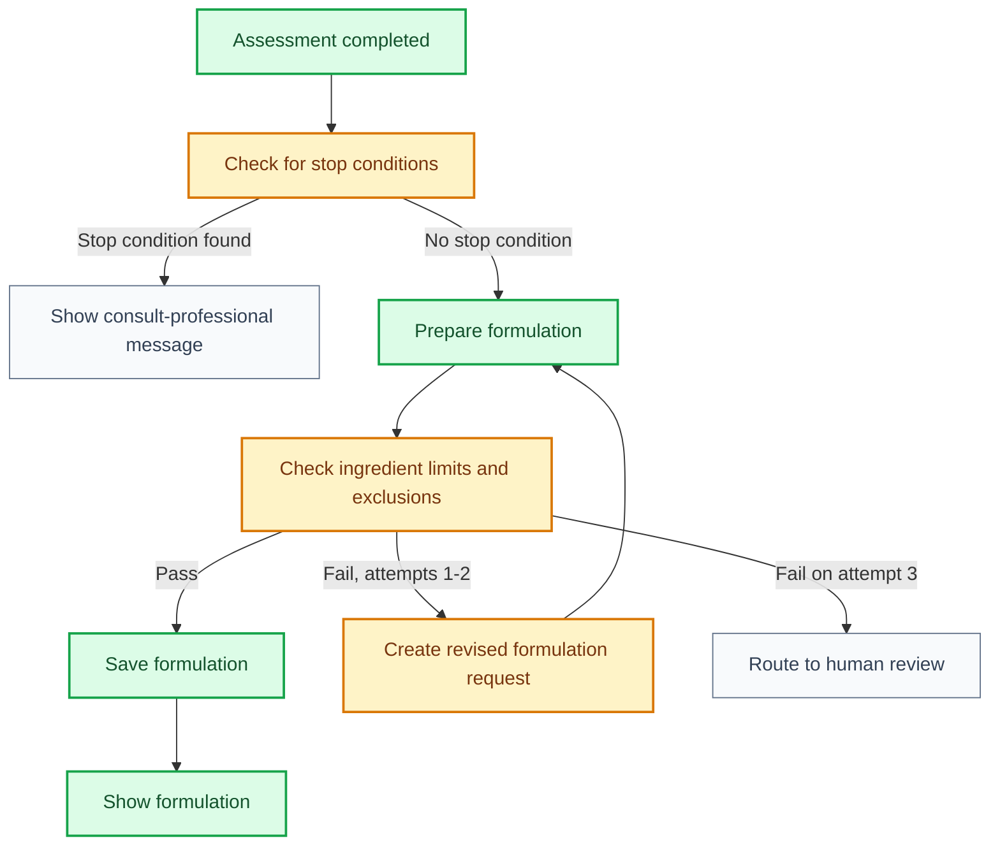

# MattaNutra Business Process Roadmap

This document distils the business process from the revised roadmap and maps it to the current product state. Technical choices, vendor details, credentials, hosting decisions, and implementation mechanics have been removed.

## Status Legend

| Status | Meaning |
| --- | --- |
| Done | Already working in the current product |
| In Progress | Partly built or present as a placeholder |
| Pending | Not yet built |
| Decision Needed | Business decision or external dependency required |

## Current State Summary

MattaNutra already has the core assessment-to-formulation journey working. A customer can land on the site, complete an anonymous assessment, select a plan level, and receive a personalised nutritional formulation generated from their answers.

The main missing business pieces are payment activation, product matching, affiliate purchase links, safety governance, and ongoing customer follow-up.

| Business Area | Current State | Status |
| --- | --- | --- |
| Brand and website | MattaNutra branding, English and Thai pages, legal pages, footer, and core site navigation exist. | Done |
| Anonymous assessment | Questionnaire captures profile, goals, lifestyle, preferences, and constraints. | Done |
| Assessment sanity check | Basic impossible values and stop conditions still need a formal business path. | In Progress |
| Assessment storage | Assessment answers are saved before payment so abandoned paywall users are still captured. | Done |
| Plan selection | Customer can choose Precision or Pro before formulation processing. | Done |
| Formulation generation | Assessment answers are processed and return a personalised formulation. | Done |
| Formulation storage | The final formulation is saved before the results page renders it. | Done |
| Bilingual result display | Formulation fields can be returned and shown in English or Thai. | Done |
| Product recommendations | Result page handles recommendations, but live product matching is not yet active. | In Progress |
| Recommendation storage | Recommendation versions can be saved, but live matched content is not yet active. | In Progress |
| Chat support | Chat CTA exists, but live advisor workflow is not fully connected. | In Progress |
| Payment | Plan selection exists, but payment collection is not yet active. | Pending |
| Payment abandonment | Assessment is saved first, but abandoned-payment follow-up is not yet active. | Pending |
| Affiliate purchase journey | Business model is affiliate-led, but affiliate product links are not yet live. | Pending |
| Safety governance | Disclaimers and legal pages exist; dosing rules, exclusions, and practitioner review are still needed. | In Progress |
| Social operations | Social presence and inbound handling remain a business operations task. | Pending |
| Follow-up and retention | Reassessment, reorder, and lifecycle messaging are not yet active. | Pending |
| Admin and reporting | Operational dashboard and funnel reporting are not yet active. | Pending |

## Target Customer Journey

```mermaid
flowchart LR
  A["Visitor lands on MattaNutra"] --> B["Completes anonymous assessment"]
  B --> C["Assessment is saved"]
  C --> D["Questionnaire sanity check"]
  D -->|Pass| E["Chooses plan level"]
  D -->|Fail| L["Correct answers or route to human review"]
  E --> M["Payment"]
  M -->|Paid| N["Personalised formulation is prepared"]
  M -->|Abandoned| R["Abandoned-payment follow-up"]
  N --> O["Safety checks"]
  O -->|Pass| P["Formulation is saved"]
  O -->|Fail| L
  P --> F["Customer views results"]
  F --> G["Matched products are prepared"]
  G --> Q["Recommendations are saved"]
  Q --> H["Customer buys through affiliate link"]
  F --> I["Customer connects to advisor chat"]
  I --> J["Ongoing support and refinement"]
  H --> K["Reassessment and reorder prompts"]

  classDef done fill:#dcfce7,stroke:#16a34a,color:#14532d,stroke-width:2px;
  classDef progress fill:#fef3c7,stroke:#d97706,color:#78350f,stroke-width:2px;
  classDef pending fill:#f8fafc,stroke:#64748b,color:#334155,stroke-width:1px;

  class A,B,C,E,N,P,F done;
  class D,O,G,Q,I,L progress;
  class H,J,K,M,R pending;
```

## Business Process Gates

## Operating Model

```mermaid
flowchart LR
  subgraph Acquisition["Customer Acquisition"]
    A1["Website"] --> A2["Social channels"]
    A2 --> A3["Chat entry points"]
  end

  subgraph Assessment["Assessment and Plan"]
    B1["Anonymous questionnaire"] --> B2["Assessment saved"]
    B2 --> B3["Questionnaire sanity check"]
    B3 --> B4["Plan selection"]
    B4 --> B5["Payment"]
    B5 --> B6["Abandoned-payment follow-up"]
  end

  subgraph Formulation["Formulation"]
    C1["Assessment review"] --> C2["Personalised formulation"]
    C2 --> C3["Safety checks"]
    C3 --> C4["Formulation saved"]
    C4 --> C5["Results displayed"]
  end

  subgraph Commerce["Commerce"]
    D1["Product matching"] --> D2["Recommendations saved"]
    D2 --> D3["Affiliate basket"]
    D3 --> D4["Customer buys on marketplace"]
  end

  subgraph Retention["Retention"]
    E1["Advisor chat"] --> E2["Follow-up prompts"]
    E2 --> E3["Reassessment"]
  end

  A1 --> B1
  A3 --> B1
  B5 --> C1
  C5 --> D1
  C5 --> E1
  D4 --> E2

  classDef done fill:#dcfce7,stroke:#16a34a,color:#14532d,stroke-width:2px;
  classDef progress fill:#fef3c7,stroke:#d97706,color:#78350f,stroke-width:2px;
  classDef pending fill:#f8fafc,stroke:#64748b,color:#334155,stroke-width:1px;
  classDef decision fill:#fee2e2,stroke:#dc2626,color:#7f1d1d,stroke-width:2px;

  class A1,B1,B2,B4,C1,C2,C4,C5 done;
  class A3,B3,C3,D1,D2,E1 progress;
  class A2,B5,B6,D3,D4,E2,E3 pending;
```

## Simplified Process Detail

### 1. Brand and Trust

Purpose: make MattaNutra look credible enough for a customer to start the assessment.

Current state: website, brand, English and Thai pages, privacy policy, terms, and wellness disclaimers are in place.

Next business work:

- Finalise social handles.
- Ensure the public website includes enough information for payment and affiliate review.
- Add a simple contact route for customer trust.

### 2. Assessment

Purpose: collect enough anonymous information to personalise the formulation.

Current state: built and working.

The assessment captures:

- Profile basics.
- Region.
- Goals.
- Lifestyle.
- Diet.
- Medication and supplement considerations.
- Preferences such as budget and capsule limit.

Next business work:

- Review all questions for regulatory sensitivity.
- Confirm any values that should stop the process and route to human review.
- Confirm the customer-facing message when the sanity check fails.

### 2.1 Questionnaire Sanity Check

Purpose: catch impossible, contradictory, or high-risk answers before taking payment or preparing a formulation.

Current state: partially defined. The assessment has required fields, but the formal failed-sanity path still needs to be completed.

The sanity check should catch:

- Impossible profile values.
- Missing required answers.
- Contradictory answers.
- Joke or clearly unusable submissions.
- High-risk answers that should not continue automatically.

If the sanity check fails:

1. If the issue is fixable, ask the customer to correct the answers.
2. If the issue is high-risk, stop the automated journey and route to human review.
3. Do not take payment until the assessment passes or is approved for continuation.

### 3. Plan and Payment

Purpose: convert the assessment into a paid or supported plan.

Current state: plan selection exists. Payment is not connected.

Planned plans:

| Plan | Business Promise |
| --- | --- |
| Precision Plan | Full personalised formulation and product guidance. |
| Pro Plan | Precision Plan plus ongoing AI advisor support and refinement. |

Next business work:

- Confirm pricing.
- Confirm refund policy.
- Activate payment acceptance.
- Decide what happens if payment fails or is abandoned.
- Use the saved assessment to support a respectful follow-up if the customer abandons payment.

### 4. Formulation

Purpose: turn assessment answers into a clear wellness formulation.

Current state: working. The formulation is prepared, saved, and then rendered on the results page.

The formulation result should remain:

- Concise.
- Bilingual.
- Tied to the customer assessment.
- Safe in tone.
- Free of disease-treatment claims.
- Saved before it is displayed to the customer.

Next business work:

- Add formal safety review rules.
- Define when a customer should be shown a “consult a qualified professional” message instead of a formulation.
- Identify the qualified reviewer for formula logic and compliance sign-off.

### 5. Product Matching

Purpose: translate the formulation into trustworthy products the customer can buy.

Current state: not active yet. The result page can gracefully show no products.

Target process:

1. Maintain a curated list of trusted products.
2. Match products to formulation ingredients.
3. Prefer fewer products when one product covers multiple ingredients.
4. Save the matched recommendation set.
5. Show clear product rationale.
6. Send the customer to marketplace purchase links.

Next business work:

- Confirm first ingredient scope.
- Build the initial trusted product list.
- Confirm affiliate approval and link rules.
- Define product quality standards.

### 6. Safety and Compliance

Purpose: keep the service in the wellness category and reduce avoidable risk.

Current state: legal pages and disclaimers exist. Hard safety rules are still needed.

Business rules to define:

- Conditions that stop formulation generation.
- Ingredients that should be excluded for pregnancy, medication conflicts, age, or serious health conditions.
- Maximum daily supplement amounts.
- Human review triggers.
- How long records should be retained.

Safety should be treated as a hard gate, not a warning at the end.

### 7. Advisor Support

Purpose: give customers a way to continue the conversation after receiving their plan.

Current state: advisor CTA exists. The live chat workflow is not complete.

Target process:

- Customer opens preferred chat channel.
- Customer shares their plan reference.
- Advisor retrieves the customer’s plan.
- Advisor helps refine timing, routine, travel, diet, and practical use.

Next business work:

- Confirm which chat channels launch first.
- Confirm advisor behaviour and escalation rules.
- Define what support is included in each plan.

### 8. Retention and Operations

Purpose: turn a one-time formulation into an ongoing relationship.

Current state: not active.

Target process:

- Follow up after purchase.
- Prompt reassessment.
- Support reorder decisions.
- Track customer outcomes.
- Review conversion and retention metrics weekly.

## Current MVP Gap Map

| Gap | Why It Matters | Suggested Priority |
| --- | --- | --- |
| Payment activation | Required for paid conversion. | High |
| Affiliate approval and link setup | Required for revenue from product purchases. | High |
| Product whitelist | Required for trustworthy recommendations. | High |
| Safety stop rules | Required before scaling traffic. | High |
| Qualified reviewer | Reduces compliance and trust risk. | High |
| Live chat workflow | Needed for Pro Plan value. | Medium |
| Social launch | Needed for low-cost customer acquisition. | Medium |
| Follow-up and reassessment | Needed for retention and repeat use. | Medium |
| Admin reporting | Needed once traffic begins. | Medium |

## Recommended Next Sequence

1. Finish payment readiness.
2. Confirm affiliate onboarding and marketplace link rules.
3. Build the first trusted product list.
4. Add safety stop rules and ingredient exclusion rules.
5. Connect product matching to the result page.
6. Make advisor chat work for one channel first.
7. Add follow-up and reassessment messages.
8. Add basic operational reporting.

## Open Business Decisions

| Decision | Needed Because |
| --- | --- |
| Final pricing for Precision and Pro | Required before payment launch. |
| First product category scope | Keeps product matching manageable. |
| Qualified reviewer | Needed for formulation logic and claim review. |
| Support promise for Pro | Defines what customers are buying. |
| Product quality standard | Protects trust and reduces poor recommendations. |
| Stop-condition policy | Defines when MattaNutra should not generate a plan. |

## One-Line Business Process

MattaNutra captures an anonymous wellness assessment, turns it into a personalised nutritional formulation, connects that formulation to trusted purchasable products, and supports the customer over time through reassessment and advisor-led refinement.
