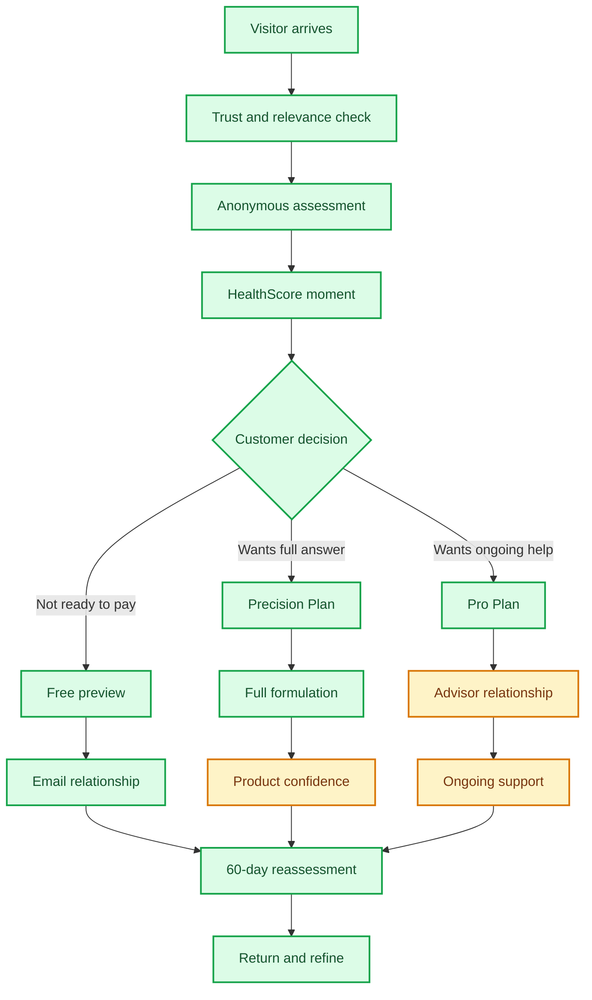
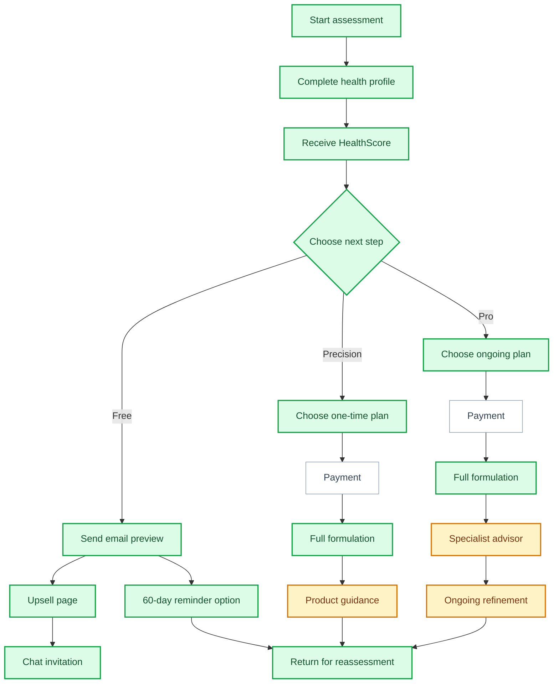

# MattaNutra Business Process Roadmap

This document describes the MattaNutra customer and business process in business terms. It focuses on the decisions we need customers to make, the value we need to prove at each point, and the weaknesses that may reduce conversion.

It intentionally avoids internal process detail.

## Status Legend

| Status | Meaning |
| --- | --- |
| Done | Present in the current product |
| Partial | Present but incomplete, unproven, or dependent on another decision |
| Pending | Not live yet |

## Executive Summary

MattaNutra currently has the core shape of a commercial wellness journey:

1. A visitor can start an anonymous assessment.
2. The assessment produces a HealthScore.
3. The HealthScore creates a moment to choose between a free email preview, Precision Plan, or Pro Plan.
4. A paid user can receive a full personalised nutritional formulation.
5. A free user can receive a smaller email preview and be invited back.
6. Users can be invited into chat and future reassessment.

The strongest parts of the current journey are the anonymous assessment, HealthScore, plan gate, formulation page, free email path, and 60-day reassessment concept.

The weakest commercial points are payment activation, proof of product trust, live advisor value, product matching, and clear safety governance. These are the areas most likely to block conversion or create risk as traffic grows.

## Sales Funnel View

MattaNutra should be read as a trust-building funnel, not only as an assessment tool. Each step must earn the right to ask for the next step.

| Funnel Stage | Customer Mindset | Business Goal | Current Strength | Main Weakness | Suggested Tune |
| --- | --- | --- | --- | --- | --- |
| Awareness | "Is this relevant to me?" | Get the right visitors to start | Clear wellness and personalisation promise | Need stronger proof and education content | Use specific, relatable use cases: energy, longevity, sleep, budget-conscious guidance |
| Assessment start | "Will this waste my time?" | Reduce friction and fear | Anonymous, structured, low-pressure | Risk of feeling like a long form | Show time expectation, privacy reassurance, and progress clearly |
| Assessment completion | "Was this worth doing?" | Create anticipation | Good data capture | Some optional detail may feel cognitively heavy | Make optional precision feel like a benefit, not homework |
| HealthScore | "Did it understand me?" | Deliver pre-payment value | Strong conversion moment already exists | Needs sharper insight hierarchy | Lead with the one insight most likely to make the user care |
| Free preview | "Can I try before buying?" | Capture lead and nurture | Good fallback path | The free value boundary is not yet defined | Make the preview useful but clearly incomplete |
| Precision Plan | "Is this worth a one-time payment?" | Convert intent into revenue | Clear one-time product | Payment not active; product value needs proof | Show exact unlocks: formulation, dose logic, product guidance, reassessment |
| Pro Plan | "Why pay monthly?" | Create recurring revenue | Strong idea: ongoing advisor | Promise is still abstract | Show daily-life examples: travel, meals, sleep changes, training days |
| Results page | "Can I act on this?" | Deliver satisfaction and confidence | Full formulation exists | Product trust is partial | Make benefits, dose, timing, and product form very easy to scan |
| Product purchase | "Can I trust this product?" | Capture affiliate value | Commercial path identified | Trusted product guidance not live | Build quality proof into recommendations before scaling |
| Follow-up | "Is this helping over time?" | Increase retention and reactivation | 60-day reassessment concept exists | Broader nurture not defined | Use score movement as the reason to return |

## Business Journey

## Main Customer Decision Points

| Decision Point | Customer Question | Current State | Business Critique |
| --- | --- | --- | --- |
| Landing page | "Is this for someone like me?" | Done | The brand and CTA exist, but the page must quickly prove personalisation and trust. |
| Assessment start | "Is this safe and worth my time?" | Done | The anonymous positioning helps. The business should keep the assessment short enough to avoid fatigue. |
| Assessment completion | "Have I given enough useful information?" | Done | The flow captures good data, but formal sanity and high-risk checks are still incomplete. |
| HealthScore | "Did MattaNutra understand me?" | Done | This is the key pre-payment value moment. It should be sharpened into the strongest conversion asset. |
| Free preview | "Can I get value without paying yet?" | Done | Good lead capture path. The business must decide exactly how generous the free preview should be. |
| Paid plan choice | "Is the full plan worth paying for?" | Partial | The plans exist, but payment is not live and the value difference between Precision and Pro needs sharper proof. |
| Full formulation | "Is this specific, practical, and safe?" | Done | The result exists. The business should continue simplifying the explanation of benefits, dose, timing, and practical use. |
| Product recommendations | "Can I trust what to buy?" | Partial | This is commercially important but not yet strong as trusted buying guidance. Without trust, affiliate conversion will suffer. |
| Advisor chat | "Can I get help adapting this to real life?" | Partial | Chat CTA exists, but the advisor experience is not yet proven as a paid Pro benefit. |
| Reassessment | "Will this improve over time?" | Done for first reminder | Strong retention concept. Wider lifecycle follow-up is still undefined. |

## Conversion and Service Levers

| Lever | Why It Helps Conversion | Why It Helps Satisfaction | Suggested Change |
| --- | --- | --- | --- |
| Make the HealthScore more explanatory | Users need a reason to continue | Users feel understood, not scored generically | Add one plain-language "what is holding you back most" insight near the score |
| Show paid value before price | Reduces price resistance | Makes the purchase feel informed | Use a concise "what unlocks" comparison between free, Precision, and Pro |
| Give the free path a clear next step | Prevents free users from disappearing | Makes the free experience feel complete | After the email preview, invite the user to improve one score area and return in 60 days |
| Make Pro use cases concrete | Helps justify recurring payment | Sets expectations for service | Show examples: "What should I take on a poor sleep day?", "How do I adjust while travelling?" |
| Make product recommendations trustworthy | Supports affiliate conversion | Reduces buyer anxiety | Show quality criteria, coverage, form, and price confidence |
| Connect chat with the plan | Increases engagement after result | Avoids making the user repeat themselves | Make the plan reference visible and explain what the advisor can do with it |
| Make safety visible but calm | Builds trust without scaring users | Protects the user and brand | Use plain wellness disclaimers and stop-condition messaging where needed |

## Current Commercial Flow

## Path Critique

### Free Preview Path

Business purpose: capture skeptical users who are not ready to pay.

What works:

- Low-friction email capture.
- Gives the customer a useful next step without forcing payment.
- Keeps a relationship open through the 60-day reassessment idea.
- Creates another chance to convert after the user sees value.

Weaknesses:

- The free preview must not feel too small or it will be ignored.
- It must not give away so much that Precision feels unnecessary.
- The follow-up strategy after the first email is not yet strong enough.
- Chat from the free path is promising, but plan handoff must feel effortless.

Business decision needed:

- Define the exact free preview promise: "3-point nutrition plan", "3 most important next steps", or another offer.
- Decide how soon and how often free users should be followed up.

### Precision Plan Path

Business purpose: convert users who want a complete, one-time personalised formulation.

What works:

- Clear one-time paid option.
- Good fit for customers with medium budget and moderate skepticism.
- Full formulation is already a meaningful paid deliverable.

Weaknesses:

- Payment is not active, so conversion cannot yet be measured.
- Product recommendations are not yet strong enough to carry affiliate revenue.
- Paid users need a reliable reassessment contact method.
- The page must make the paid value clearly better than the free preview.

Business decision needed:

- Confirm price, refund promise, and what exactly is included.
- Decide whether paid users must provide email before or during payment.
- Decide how product trust will be communicated.

### Pro Plan Path

Business purpose: create recurring revenue through ongoing advisor support.

What works:

- Pro has a clear strategic role: ongoing support and refinement.
- Chat is a natural channel for Thai and mobile-first customers.
- The plan can become more valuable over time through reassessment.

Weaknesses:

- "AI advisor" is not yet a concrete enough paid promise.
- The business needs examples of what the advisor actually helps with.
- Chat connection exists, but the full advisor workflow is not proven.
- Subscription payment is not active.

Business decision needed:

- Define the Pro service promise in plain customer language.
- Choose the first chat channel to make excellent.
- Decide whether Pro includes AI only, human escalation, or both.

## Key Process Weaknesses

| Weakness | Why It Matters | Business Risk |
| --- | --- | --- |
| Payment is not live | Paid conversion cannot be tested | Revenue path is unproven |
| HealthScore value is not yet optimised | This is the main conversion trigger | Users may choose free or leave |
| Safety rules are incomplete | Wellness trust depends on responsible boundaries | Regulatory, reputation, and customer risk |
| Product matching is not live | Affiliate revenue depends on trusted buying guidance | Users may buy elsewhere or not buy at all |
| Pro promise is vague | Recurring revenue needs clear ongoing value | Users may choose Precision instead |
| Advisor handoff is not seamless | Chat should feel personal and connected to the plan | Users may drop before engagement |
| Follow-up cadence is undefined | Leads need nurturing after the free preview | Email capture may not convert |
| Blog/content acquisition is not live | The site needs education and search traffic | Paid traffic may carry too much burden |

## Funnel Metrics to Watch

These are the simplest business numbers to add once measurement is ready.

| Metric | What It Reveals | Healthy Direction |
| --- | --- | --- |
| Landing to assessment start | Whether the promise and CTA are compelling | Up |
| Assessment start to completion | Whether the questionnaire feels worth finishing | Up |
| Completion to HealthScore view | Whether the transition works reliably | Up |
| HealthScore to free preview | Whether skeptical users are being captured | Up, but not at the expense of paid conversion |
| HealthScore to paid plan | Whether the score creates enough purchase intent | Up |
| Free preview to later paid plan | Whether email nurture works | Up |
| Precision to Pro mix | Whether Pro has a clear enough value proposition | Depends on strategy, but should be intentional |
| Results page to chat | Whether users want ongoing support | Up for Pro, moderate for Precision |
| Results page to product click | Whether product guidance feels trustworthy | Up |
| 60-day return rate | Whether reassessment is meaningful | Up |
| Refunds or complaints | Whether expectations are mismatched | Down |

## Customer Satisfaction Principles

- Give the customer a useful result even if they do not pay.
- Never make the customer feel trapped in a health claim or fear-based sale.
- Explain why each recommendation exists in practical language.
- Keep the plan realistic for budget, pill burden, diet, and lifestyle.
- Make it easy to ask "what should I do today?" after the formulation.
- Make returning feel natural: "your score changes as your life changes."

## Business Priorities

### 1. Make the HealthScore a Conversion Asset

The HealthScore should not just be a score. It should create a persuasive reason to continue.

Business questions:

- What is the most compelling insight shown with the score?
- Should the page lead with lowest domain, biggest improvement opportunity, or comparison to peers?
- What should the customer believe after seeing the score?

### 2. Define the Free Preview Boundary

The free preview is a lead magnet, not the product.

Business questions:

- What exactly is included?
- What is held back for paid plans?
- What follow-up sequence should start after the free preview?

### 3. Activate the Paid Plan Moment

Precision and Pro must have a clean purchase decision.

Business questions:

- What payment methods are essential for Thai customers?
- What refund or satisfaction promise reduces hesitation?
- Should payment happen before or after showing a deeper teaser?

### 4. Make Product Trust Visible

The formulation creates intent. Product guidance captures commercial value.

Business questions:

- What makes a product "trusted"?
- How should quality, coverage, form, and price be explained?
- How should the business handle cases where no good product match exists?

### 5. Make Pro Tangible

Pro should feel like an ongoing wellness companion, not just a more expensive version of Precision.

Business questions:

- What are the top five real-life advisor use cases?
- Which channel should be prioritised first?
- Should Pro include human review or escalation?

## Recommended Next Business Sequence

1. Finalise the HealthScore conversion message.
2. Define the free preview content boundary.
3. Activate payment for Precision and Pro.
4. Define safety stop rules and customer-facing safety messages.
5. Create the first trusted product recommendation standard.
6. Make one chat channel work end-to-end.
7. Define the Pro service promise.
8. Build the first follow-up sequence after free preview.
9. Add blog and educational content for acquisition.
10. Add funnel reporting so the team can see where customers drop.

## One-Line Business Process

MattaNutra earns trust with an anonymous assessment and HealthScore, converts customers through either a free preview or paid plan, then uses formulation, product guidance, advisor support, and reassessment to build an ongoing wellness relationship.
