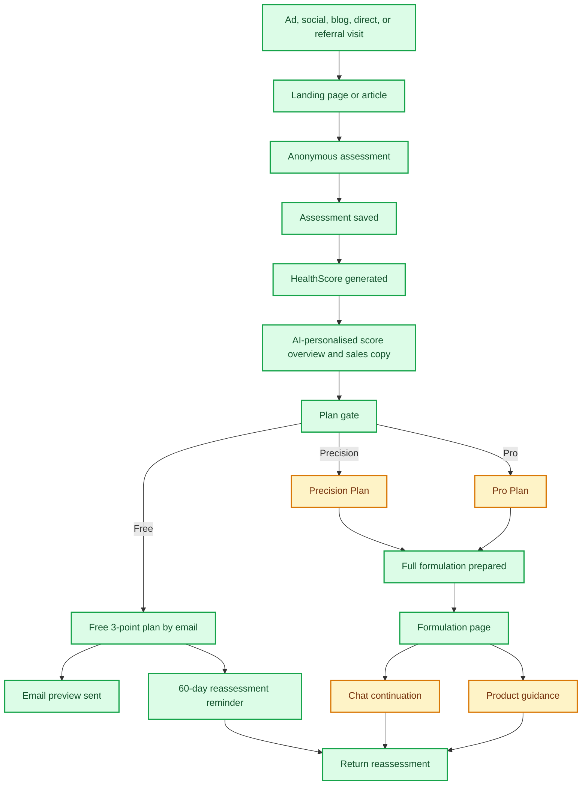
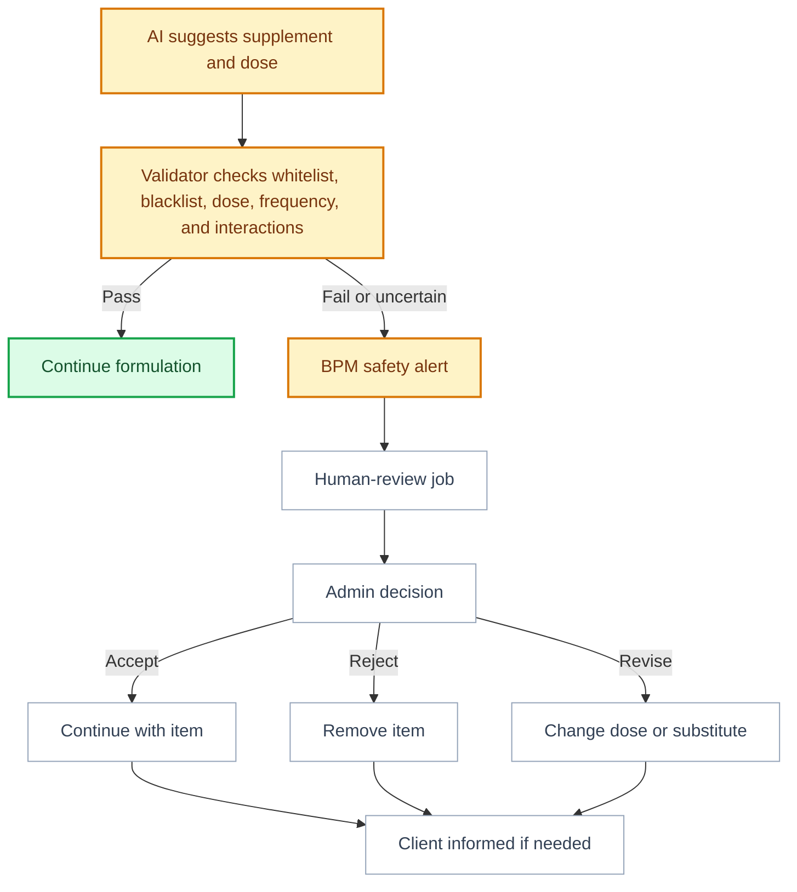

# MattaNutra Business Blueprint

This is the single business-facing blueprint for MattaNutra. It explains what the product does today, how the sales funnels work, what is measured, and what remains to be built.

## Business Model

MattaNutra earns trust through an anonymous wellness assessment and HealthScore, then converts users into one of three paths:

| Path | User Intent | Business Purpose | Status |
| --- | --- | --- | --- |
| Free HealthScore | "Show me something personal before I trust this." | Build trust and demonstrate relevance | Done |
| Free 3-point email plan | "I am interested, but not ready to pay." | Capture leads and nurture later conversion | Done |
| Precision Plan | "I want a complete answer now." | One-time paid personalised nutrition plan | Partial: offer exists, payment pending |
| Pro Plan | "I want ongoing support." | Recurring advisor relationship | Partial: offer exists, advisor handoff pending |
| Product guidance | "What should I actually buy?" | Future affiliate revenue and customer convenience | Partial: results area exists, matching not live |
| Blog and testimonials | "Can I learn and trust the brand?" | Marketing engine for paid, social, and organic traffic | Partial: platform live, cadence pending |
| Admin analytics | "Where are users converting or dropping out?" | Tune marketing spend and the product funnel | Partial: KPI and Flow views live, operations views pending |

## Current Funnel

## What Works Now

- Anonymous assessment in English and Thai.
- Backend-owned HealthScore using the business workbook formula.
- HealthScore page with score, six-domain snapshot, radar visualisation, and AI-generated overview.
- AI-personalised plan-gate copy and three feature cards.
- Separate AI paths: one shared Grok model with lighter reasoning for HealthScore/marketing copy and deeper reasoning for formulation generation.
- HealthScore/marketing AI responses are cached for up to one week to reduce latency and cost.
- Free email lead capture.
- Free email sends the top three supplement suggestions from the actual generated formulation.
- Recurring 60-day reassessment scheduling with unsubscribe.
- Formulation jobs and worker queue.
- Grok formulation generation with validation/retry pattern.
- Formulation page renders stored backend data.
- Blog and testimonial tables, pages, and protected admin APIs.
- BPM tracking for funnel, campaign, affiliate, safety, error, email, chat, and formulation events.
- Admin dashboard with KPI and Flow views over hour, day, week, month, year, and all-time windows.
- Dashboard filters for locale, device, source, medium, campaign, campaign ID, affiliate, promo code, selected plan, plan ID, ray, and email hash.

## Main Gaps

| Gap | Why It Matters | Suggested Next Step |
| --- | --- | --- |
| Payment activation | Cannot test revenue conversion yet | Wire Precision/Pro checkout once account is ready |
| Admin operations views | Sales analytics exist, but safety, jobs, content, and supplement operations still need interfaces | Add safety/job queues after the sales funnel view stabilises |
| Supplement governance | AI output needs hard business rules around approved doses and exclusions | Build whitelist, blacklist, dose/frequency, and interaction tables |
| Product matching | Affiliate revenue depends on trusted products | Start with curated whitelist before marketplace automation |
| Chat handoff | Pro needs a convincing ongoing service experience | Make one channel excellent first, likely LINE |
| Human safety review | Flagged suggestions need an operational decision process | Add `human_review` jobs and admin review screens |
| Follow-up nurture | Free users need more than one email | Define post-preview sequence |

## Sales Funnel Paths

### Free Path

Goal: convert skeptical visitors into known leads without forcing a payment decision.

Current flow:

1. User completes assessment.
2. User sees HealthScore.
3. User chooses free 3-point email plan.
4. System generates the full formulation but emails only the top three supplement suggestions.
5. User can opt into recurring 60-day reassessment.

What is good:

- Low friction.
- Gives real value.
- Creates a reason to return.

Risk:

- The free plan must be useful enough to build trust, but not so complete that Precision loses value.

### Precision Plan

Goal: one-time conversion for users who want a complete personalised nutritional plan.

Current promise:

- Full nutritional formulation.
- Doses, forms, timing, and rationale.
- Product guidance area.
- Reassessment prompt.

Risk:

- Payment is not live yet, so true conversion cannot be measured.
- Product trust needs to be clear before recommendations become commercially important.

### Pro Plan

Goal: recurring relationship through an AI supplement advisor.

Current promise:

- Everything in Precision.
- Ongoing refinement and daily-life support.
- Chat-based continuation.

Risk:

- The advisor needs concrete use cases: travel, changed sleep, meals out, training changes, new lab data, medication changes, and budget changes.
- The chat platform must reliably associate the user with their plan.

## BPM and Admin Dashboard

BPM is the measurement and alerting layer. It is not the operational workflow itself.

It captures:

- `ray`: anonymous journey/session UUID.
- UTM fields.
- campaign IDs and campaign names.
- promo codes.
- affiliate IDs, refs, sub IDs, and click IDs.
- referrer, source channel, source URL, landing page, device, browser, and OS.
- page views and CTA clicks.
- assessment, HealthScore, plan-gate, free-email, formulation, email, chat, product, reassessment, safety, and error events.
- hashed email and hashed IP only; raw email/IP are not stored in BPM.

Current wired examples:

| Area | Events |
| --- | --- |
| Website | `home_viewed`, `home_hero_assessment_clicked`, `home_bottom_assessment_clicked` |
| Blog | `blog_article_viewed`, `blog_card_clicked`, `blog_assessment_cta_clicked` |
| Assessment | `assessment_viewed`, `assessment_started`, `assessment_submitted`, `assessment_captured` |
| HealthScore | `healthscore_viewed`, `plan_gate_viewed` |
| Plans | `plan_selected_clicked`, `plan_selected` |
| Free email | `free_email_requested_clicked`, `free_email_requested`, `free_email_sent` |
| Formulation | `formulation_requested`, `formulation_ready`, `free_example_formulation_ready` |
| Reassessment | `reassessment_opted_in`, `reassessment_email_sent` |
| Chat and affiliate | `chat_channel_clicked`, `marketplace_product_clicked` |
| Errors | `assessment_api_error`, `free_email_request_error`, `worker_job_failed` |

Current admin dashboard:

1. KPI view for free conversions, paid Precision conversions, and paid Pro conversions.
2. Conversion-rate cards with formulas and short trend forecasts.
3. Flow view showing the observed user journey from landing through assessment, HealthScore, free email, paid plan, nutrition plan, results, chat, and marketplace clicks.
4. Flow boxes show visits and drops, with border colours highlighting healthier or weaker stages.
5. Timeframe controls: hour, day, week, month, year, and all time.
6. Locale controls as EN and TH toggle pills. Both are selected by default.
7. Collapsible filters for source, medium, campaign, campaign ID, affiliate, promo code, plan, device, plan ID, ray, and email hash.
8. Filters are URL-driven and server-side, so KPI and Flow views use the same BPM slice.

Remaining admin dashboard work:

1. Campaign and affiliate comparison tables.
2. Safety and error alert panels.
3. Pending jobs and human-review queues.
4. Ray drill-down for a single anonymous journey.
5. Content, testimonial, supplement whitelist, blacklist, and interaction-rule management.
6. Revenue and payment reporting after checkout is live.

## Supplement Governance

This should be managed from the admin dashboard.

### Whitelist

The whitelist is the approved supplement catalogue. It should define:

- supplement/ingredient name
- form, such as capsule, powder, liquid
- approved minimum dose
- approved maximum dose
- dose unit
- frequency range
- timing guidance
- age/sex/pregnancy notes
- evidence/source notes
- whether it can be shown to users
- whether it can be matched to products

### Blacklist

The blacklist blocks previously rejected supplements or unsafe dose patterns. It should define:

- supplement/ingredient name
- banned dose or dose range
- banned frequency, where relevant
- reason
- severity
- whether the ban is absolute or context-specific
- reviewer/admin who made the decision

### Interaction Rules

Interaction rules should flag risks based on:

- existing medications
- existing conditions
- pregnancy or breastfeeding
- age ranges
- high-risk lab values
- duplicate supplementation
- dose or frequency above approved limits

### Human Review

When a suggestion fails a hard safety check:

The job queue should carry the actionable work item: `job_type = 'human_review'`.

The safety review record should carry the operational details: supplement, dose, rule, context, reviewer decision, and client notification state.

## Content and Marketing Engine

Blog articles and testimonials are database-driven and can be managed by OpenClaw or another admin system using protected APIs.

Purpose:

- create trust before asking for assessment completion
- support paid and social campaigns
- give affiliate/social partners useful pages to share
- educate without making medical claims
- move readers into the HealthScore assessment

Best use:

- broad traffic to home page
- problem-aware traffic to blog articles
- high-intent traffic directly to assessment

## Near-Term Build Sequence

1. Campaign/affiliate reporting tables on top of the live BPM dashboard filters.
2. Safety, error, and stuck-job panels in the admin dashboard.
3. Supplement whitelist, blacklist, and interaction rules.
4. Human-review jobs and admin review screens.
5. Payment integration for Precision and Pro.
6. Product matching against approved supplement/product whitelist.
7. One excellent chat handoff, likely LINE first.
8. Free email nurture sequence.
9. Pro advisor use-case design.

## One-Line Narrative

MattaNutra turns anonymous wellness answers into a HealthScore, uses that score to start a personalised relationship, and then helps the user choose the right level of guidance: free preview, complete plan, or ongoing specialist advisor support.
