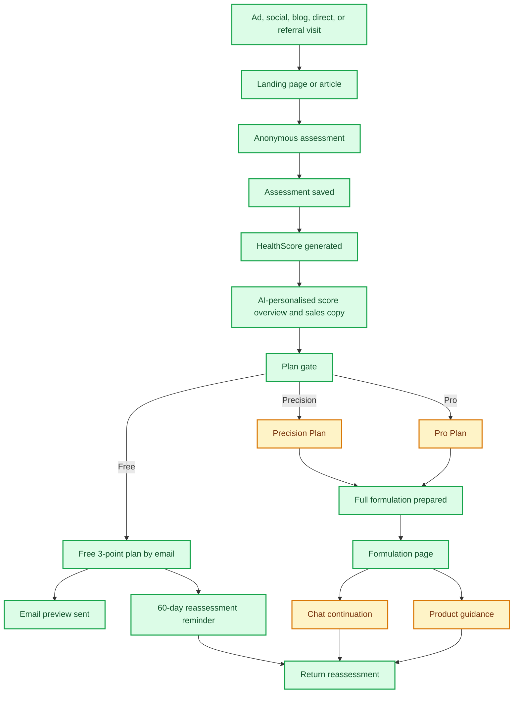
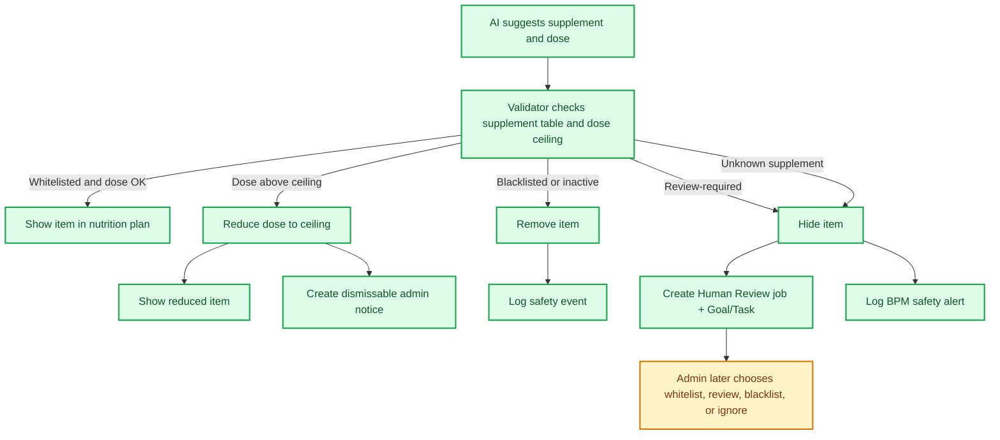

# MattaNutra Business Blueprint

This is the single business-facing blueprint for MattaNutra. It explains what the product does today, how the sales funnels work, what is measured, and what remains to be built.

## Business Model

MattaNutra earns trust through an anonymous wellness assessment and HealthScore, then converts users into one of three paths:

| Path | User Intent | Business Purpose | Status |
| --- | --- | --- | --- |
| Free HealthScore | "Show me something personal before I trust this." | Build trust and demonstrate relevance | Done |
| Free 3-point email plan | "I am interested, but not ready to pay." | Capture leads and nurture later conversion | Done |
| Precision Plan | "I want a complete answer now." | One-time paid personalised nutrition plan | Partial: offer exists, payment pending |
| Pro Plan | "I want ongoing support." | Recurring advisor relationship | Partial: offer exists, advisor handoff pending |
| Product guidance | "What should I actually buy?" | Future affiliate revenue and customer convenience | Partial: results area exists, matching not live |
| Blog and testimonials | "Can I learn and trust the brand?" | Marketing engine for paid, social, and organic traffic | Partial: platform live, cadence pending |
| Admin analytics | "Where are users converting, dropping out, or needing attention?" | Tune marketing spend, product funnel, and operations | Partial: KPI, Conversions, Supplements, Human Review, Technical Alerts, and Jobs views live |

## Current Funnel

## What Works Now

- Anonymous assessment in English and Thai.
- Backend-owned HealthScore using the business workbook formula.
- HealthScore page with score, six-domain snapshot, radar visualisation, and AI-generated overview.
- AI-personalised, sales-optimised plan-gate copy and three feature cards anchored to the user's actual assessment signals.
- Separate AI paths: one shared Grok model with medium reasoning for HealthScore sales copy and formulation generation.
- HealthScore/marketing AI responses are cached for up to one week to reduce latency and cost.
- Free email lead capture.
- Free email sends the top three supplement suggestions from the actual generated formulation.
- Recurring 60-day reassessment scheduling with unsubscribe.
- Formulation jobs and worker queue, now bridged into Goals/Tasks for task-backed processing.
- Grok formulation generation with validation/retry pattern.
- Supplement whitelist, blacklist, dose ceilings, safety flags, and admin editing.
- Automated formulation safety check: blacklisted items are removed, over-limit doses are reduced, and uncertain/new items are hidden for review.
- Human Review queue for supplement safety work items and dose-reduction notifications, now bridged into Goals/Tasks for traceability.
- Formulation page renders stored backend data.
- Blog and testimonial tables, pages, and protected admin APIs.
- BPM tracking for funnel, campaign, affiliate, safety, error, email, chat, and formulation events.
- Admin dashboard with KPI and Conversions views over hour, day, week, month, year, and all-time windows.
- Admin Technical section with Alerts and Jobs views for failed email sends, stuck jobs, cron failures, AI/worker errors, and recent job history.
- Goal-based task architecture foundation: goals group tasks, agents reserve work by goal priority first, staged task sequences support ordered work, and task events/comments preserve cause-and-effect. Supported legacy jobs now create task-backed work items before the old worker fallback.
- Admin Goals view showing goal status, priority, source, BPM/session ray, tasks, events, comments, dependencies, reservations, and approvals.
- Dashboard filters for locale, device, source, medium, campaign, campaign ID, affiliate, promo code, selected plan, plan ID, ray, and email hash.

## Main Gaps

| Gap | Why It Matters | Suggested Next Step |
| --- | --- | --- |
| Payment activation | Cannot test revenue conversion yet | Wire Precision/Pro checkout once account is ready |
| Admin operations views | Sales analytics, goals, task visibility, technical alerts, legacy jobs, supplement review, and supplement editing basics exist; content and campaign comparison views still need interfaces | Add campaign and content panels |
| Supplement governance | Whitelist, blacklist, max dose, and safety review basics exist; frequency and interaction rules are not wired yet | Add frequency, condition, medication, pregnancy, and lab interaction checks |
| Product matching | Affiliate revenue depends on trusted products | Start with curated whitelist before marketplace automation |
| Chat handoff | Pro needs a convincing ongoing service experience | Make one channel excellent first, likely LINE |
| Human safety review | Flagged suggestions now enter Human Review and create Goal/Task records; client follow-up after review still needs completion | Add client notification states, post-review worker, and audit reporting |
| Follow-up nurture | Free users need more than one email | Define post-preview sequence |

## Sales Funnel Paths

### Free Path

Goal: convert skeptical visitors into known leads without forcing a payment decision.

Current flow:

1. User completes assessment.
2. User sees HealthScore.
3. User chooses Free 3-point email plan.
4. System generates the full formulation but emails only the top three supplement suggestions.
5. User can opt into recurring 60-day reassessment.

What is good:

- Low friction.
- Gives real value.
- Creates a reason to return.

Risk:

- The Free plan must be useful enough to build trust, but not so complete that Precision loses value.

### Precision Plan

Goal: one-time conversion for users who want a complete personalised nutritional plan.

Current promise:

- Full nutritional formulation.
- Doses, forms, timing, and rationale.
- Product guidance area.
- Reassessment prompt.

Risk:

- Payment is not live yet, so true conversion cannot be measured.
- Product trust needs to be clear before recommendations become commercially important.

### Pro Plan

Goal: recurring relationship through an AI supplement advisor.

Current promise:

- Everything in Precision.
- Ongoing refinement and daily-life support.
- Chat-based continuation.

Risk:

- The advisor needs concrete use cases: travel, changed sleep, meals out, training changes, new lab data, medication changes, and budget changes.
- The chat platform must reliably associate the user with their plan.

## BPM and Admin Dashboard

BPM is the measurement and alerting layer. It is not the operational workflow itself.

It captures:

- `ray`: anonymous journey/session UUID.
- UTM fields.
- campaign IDs and campaign names.
- promo codes.
- affiliate IDs, refs, sub IDs, and click IDs.
- referrer, source channel, source URL, landing page, device, browser, and OS.
- page views and CTA clicks.
- assessment, HealthScore, plan-gate, Free email, formulation, email, chat, product, reassessment, safety, and error events.
- hashed email and hashed IP only; raw email/IP are not stored in BPM.

Current wired examples:

| Area | Events |
| --- | --- |
| Website | `home_viewed`, `home_hero_assessment_clicked`, `home_bottom_assessment_clicked` |
| Blog | `blog_article_viewed`, `blog_card_clicked`, `blog_assessment_cta_clicked` |
| Assessment | `assessment_viewed`, `assessment_started`, `assessment_submitted`, `assessment_captured` |
| HealthScore | `healthscore_viewed`, `plan_gate_viewed` |
| Plans | `plan_selected_clicked`, `plan_selected` |
| Free email | `free_email_requested_clicked`, `free_email_requested`, `free_email_sent` |
| Formulation | `formulation_requested`, `formulation_ready`, `free_example_formulation_ready` |
| Safety | `formulation_safety_review_opened`, `formulation_safety_dose_reduced`, `formulation_safety_item_removed`, `formulation_safety_completed` |
| Reassessment | `reassessment_opted_in`, `reassessment_email_sent` |
| Chat and affiliate | `chat_channel_clicked`, `marketplace_product_clicked` |
| Errors | `assessment_api_error`, `free_email_request_error`, `worker_job_failed` |

Current admin dashboard:

1. KPI view for Free conversions, paid Precision conversions, and paid Pro conversions.
2. Conversion-rate cards with formulas and short trend forecasts.
3. Conversions view showing the observed user journey from landing through assessment, HealthScore, Free email, paid plan, nutrition plan, results, chat, and marketplace clicks.
4. Conversion boxes show visits and drops, with border colours highlighting healthier or weaker stages.
5. Timeframe controls: hour, day, week, month, year, and all time.
6. Locale controls as EN and TH toggle pills. Both are selected by default.
7. Collapsible filters for source, medium, campaign, campaign ID, affiliate, promo code, plan, device, plan ID, ray, and email hash.
8. Filters are URL-driven and server-side, so KPI and Conversions views use the same BPM slice.
9. Human Review queue for supplement review jobs and dose-reduction notices.
10. Technical Alerts queue for failed jobs, stuck jobs, failed cron tasks, high/critical job audit events, and error/high BPM events.
11. Jobs view for queued, running, failed, and completed operational jobs, including attempts, timing, payload, errors, and latest audit event.
12. Goals view for milestone-level operational visibility over the newer task system.

How the admin sections should be read:

| Section | Business Question | Current Status |
| --- | --- | --- |
| KPI | Are Free, Precision, and Pro conversions increasing? | Live from BPM events |
| Conversions | Where do people continue, and where do they stop? | Live from BPM events |
| Supplements | Which supplements are allowed, blocked, or awaiting review? | Live with editable dose ceilings and safety flags |
| Human Review | What needs a human decision before being shown or acted on? | Live for supplement review and dose-reduction notices |
| Goals | What outcome is being pursued, and which tasks/events explain its current state? | Live for supplement review, formulation, Free email, reassessment, and staged task-backed work |
| Technical Alerts | What failed or looks stuck? | Live for jobs, cron, job audit, and BPM error events |
| Jobs | What legacy work has been queued, run, completed, or failed? | Live compatibility history and current execution state |

Remaining admin dashboard work:

1. Campaign and affiliate comparison tables.
2. Email-specific communications reporting if email volume makes it worth separating from Jobs/Alerts.
3. Retry actions for failed technical jobs where safe.
4. Ray drill-down for a single anonymous BPM/session journey.
5. Content, testimonial, interaction-rule, and advanced supplement decision management.
6. Revenue and payment reporting after checkout is live.

## Supplement Governance

This is managed from the admin dashboard for supplement list status, dose ceiling, confidence, and safety flags. The safety validator uses those tables when AI returns a formulation.

### Whitelist

The whitelist is the approved supplement catalogue. It currently defines:

- supplement/ingredient name
- approved maximum dose
- dose unit
- confidence level
- safety flags
- evidence/source notes
- whether it is whitelisted, review-required, blacklisted, or inactive

Still needed:

- form, frequency range, and timing guidance
- condition, medication, age, sex, pregnancy, and lab rules
- whether it can be product-matched

### Blacklist

The blacklist blocks supplements that must not be shown in automated formulations. It currently removes those items from the returned user-visible plan and logs the event.

Still needed:

- banned dose or dose range
- banned frequency, where relevant
- reason
- severity
- whether the ban is absolute or context-specific
- reviewer/admin who made the decision

### Interaction Rules

Interaction rules are not wired yet. They should flag risks based on:

- existing medications
- existing conditions
- pregnancy or breastfeeding
- age ranges
- high-risk lab values
- duplicate supplementation
- dose or frequency above approved limits

### Human Review

Current safety decision flow:

The legacy job queue still carries supplement review work as `job_type = 'supplement_review'` while this flow migrates. New review work also creates a Goal and Task, so admin decisions are visible in the goal timeline with task comments and events. The worker does not process these automatically; they appear in the admin Human Review queue for a human decision.

The safety review record carries the operational details: supplement, dose, rule, context, linked goal/task where available, reviewer decision, and client notification state.

## Content and Marketing Engine

Blog articles and testimonials are database-driven and can be managed by OpenClaw or another admin system using protected machine APIs. These APIs use `ADMIN_CLAW_TOKEN` with `Authorization: Bearer <ADMIN_CLAW_TOKEN>` or `x-admin-claw-token`; dashboard tokens are not accepted for machine API access.

Purpose:

- create trust before asking for assessment completion
- support paid and social campaigns
- give affiliate/social partners useful pages to share
- educate without making medical claims
- move readers into the HealthScore assessment

Best use:

- broad traffic to home page
- problem-aware traffic to blog articles
- high-intent traffic directly to assessment

## Near-Term Build Sequence

1. Campaign/affiliate reporting tables on top of the live BPM dashboard filters.
2. Safe acknowledge/retry/dismiss actions for technical alerts and failed jobs.
3. Supplement interaction rules for medications, conditions, pregnancy, age, and labs.
4. Post-review client notification and communication-channel fallback.
5. Payment integration for Precision and Pro.
6. Product matching against approved supplement/product whitelist.
7. One excellent chat handoff, likely LINE first.
8. Free email nurture sequence.
9. Pro advisor use-case design.

## One-Line Narrative

MattaNutra turns anonymous wellness answers into a HealthScore, uses that score to start a personalised relationship, and then helps the user choose the right level of guidance: Free preview, complete plan, or ongoing specialist advisor support.
