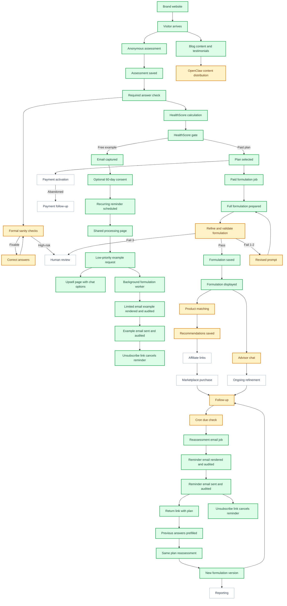

```mermaid
flowchart TB
  A["Brand website"] --> B["Visitor arrives"]
  B --> C["Anonymous assessment"]
  C --> D["Assessment saved"]
  D --> E["Required answer check"]
  E --> F["HealthScore calculation"]
  E --> E1["Formal sanity checks"]
  E1 -->|Fixable| G["Correct answers"]
  G --> E1
  E1 -->|High-risk| H["Human review"]
  F --> I["HealthScore gate"]
  I -->|Free example| J["Email captured"]
  J --> J1["Optional 60-day consent"]
  J1 --> J2["Recurring reminder scheduled"]
  J2 --> K["Shared processing page"]
  K --> L["Low-priority example request"]
  L --> M["Upsell page with chat options"]
  L --> N["Background formulation worker"]
  N --> N0["Limited email example rendered and audited"]
  N0 --> N1["Example email sent and audited"]
  N1 --> N3["Unsubscribe link cancels reminder"]
  I -->|Paid plan| O["Plan selected"]
  O --> P["Payment activation"]
  O --> Q["Paid formulation job"]
  P -->|Abandoned| R["Payment follow-up"]
  Q --> S["Full formulation prepared"]
  S --> T["Refine and validate formulation"]
  T -->|Pass| U["Formulation saved"]
  T -->|Fail 1-2| V["Revised prompt"]
  V --> S
  T -->|Fail 3| H
  U --> W["Formulation displayed"]
  W --> X["Product matching"]
  X --> Y["Recommendations saved"]
  Y --> Z["Affiliate links"]
  Z --> AA["Marketplace purchase"]
  W --> AB["Advisor chat"]
  AB --> AC["Ongoing refinement"]
  AA --> AD["Follow-up"]
  AC --> AD
  AD --> AE["Cron due check"]
  AE --> AF["Reassessment email job"]
  AF --> AG["Reminder email rendered and audited"]
  AG --> AH["Reminder email sent and audited"]
  AH --> AI["Return link with plan"]
  AH --> AO["Unsubscribe link cancels reminder"]
  AI --> AJ["Previous answers prefilled"]
  AJ --> AK["Same plan reassessment"]
  AK --> AL["New formulation version"]
  AL --> AD
  AL --> AM["Reporting"]
  B --> AN["Blog content and testimonials"]
  AN --> AP["OpenClaw content distribution"]

  classDef done fill:#dcfce7,stroke:#16a34a,color:#14532d,stroke-width:2px;
  classDef partial fill:#fef3c7,stroke:#d97706,color:#78350f,stroke-width:2px;
  classDef todo fill:#ffffff,stroke:#94a3b8,color:#334155,stroke-width:1px;

  class A,B,C,D,E,F,I,J,J1,J2,K,L,M,N,N0,N1,N3,O,Q,S,U,W,AF,AG,AH,AI,AJ,AK,AL,AN,AO done;
  class E1,G,T,V,X,Y,AB,AD,AE,AP partial;
  class H,P,R,Z,AA,AC,AM todo;
```
