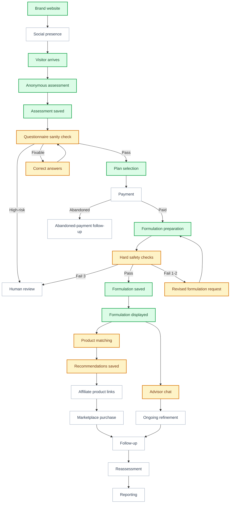

```mermaid
flowchart TB
  A["Brand website"] --> B["Social presence"]
  B --> C["Visitor arrives"]
  C --> D["Anonymous assessment"]
  D --> E["Assessment saved"]
  E --> F["Questionnaire sanity check"]
  F -->|Pass| G["Plan selection"]
  F -->|Fixable| U["Correct answers"]
  U --> F
  F -->|High-risk| L["Human review"]
  G --> V["Payment"]
  V -->|Paid| H["Formulation preparation"]
  V -->|Abandoned| Y["Abandoned-payment follow-up"]
  H --> I["Hard safety checks"]
  I -->|Pass| W["Formulation saved"]
  W --> J["Formulation displayed"]
  I -->|Fail 1-2| K["Revised formulation request"]
  K --> H
  I -->|Fail 3| L["Human review"]
  J --> M["Product matching"]
  M --> X["Recommendations saved"]
  X --> N["Affiliate product links"]
  N --> O["Marketplace purchase"]
  J --> P["Advisor chat"]
  P --> Q["Ongoing refinement"]
  O --> R["Follow-up"]
  Q --> R
  R --> S["Reassessment"]
  S --> T["Reporting"]

  classDef done fill:#dcfce7,stroke:#16a34a,color:#14532d,stroke-width:2px;
  classDef partial fill:#fef3c7,stroke:#d97706,color:#78350f,stroke-width:2px;
  classDef todo fill:#ffffff,stroke:#94a3b8,color:#334155,stroke-width:1px;

  class A,C,D,E,G,H,W,J done;
  class F,I,K,M,P,U,X partial;
  class B,L,N,O,Q,R,S,T,V,Y todo;
```
