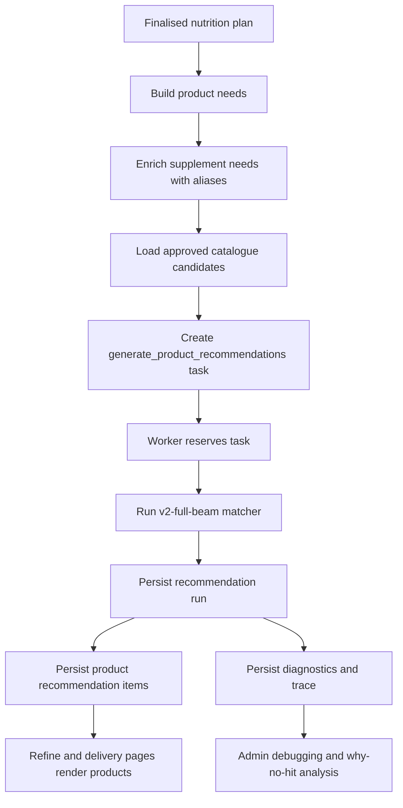
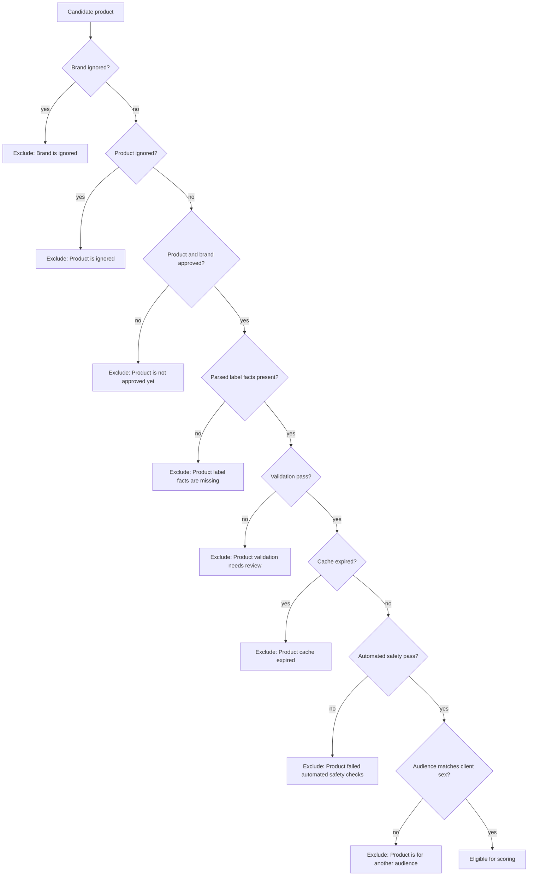
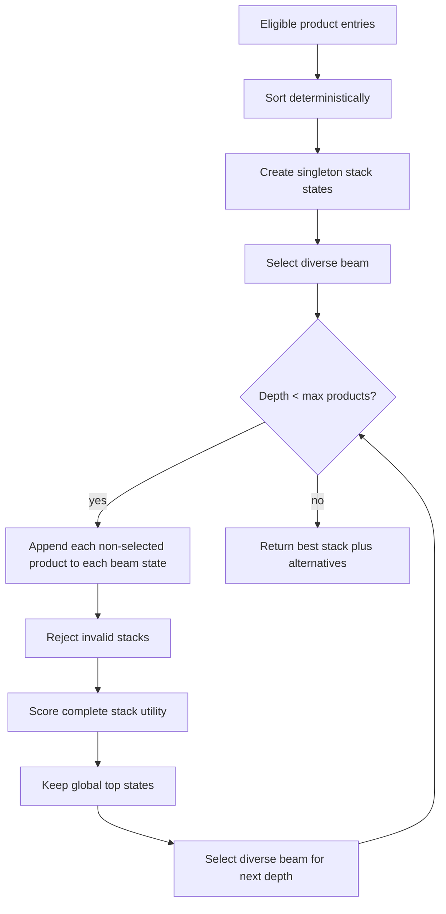
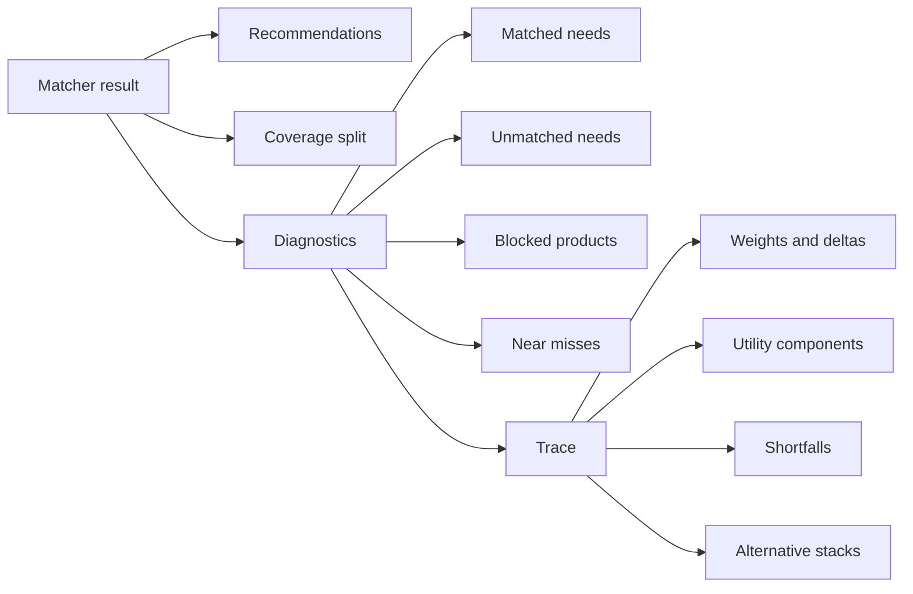

# Product Matching Algorithm

## Summary

The active customer matcher is `v2-full-beam`.

It turns a finalised nutrition plan into a compact stack of approved catalogue products. It does not search marketplaces live, call AI, mutate the database, or make network calls while scoring. It receives already-loaded product candidates and already-built client needs, then runs deterministic scoring locally.

The active path is:

- `lib/task-worker.ts` enqueues `generate_product_recommendations` with matcher version metadata.
- `lib/task-work-items.ts` builds client needs, aliases, client context, sex, and product candidates.
- `lib/task-execution.ts` calls `recommendProductStackFullBeam`.
- `lib/task-result-applier.ts` persists the recommendation run, items, diagnostics, and review tasks.
- `lib/product-recommendations.ts` contains the matcher.

The active matcher surface is intentionally small:

| Function | Role |
| --- | --- |
| `recommendProductStackV2` | exact scoring over a deterministic shortlist |
| `recommendProductStackFullBeam` | active customer matcher, beam search over the full eligible pool |
| `recommendProductStack` | default export path, currently delegates to full beam |

## End-To-End Flow



## The Matching Problem

The hard part is not finding a product whose title contains a supplement name. Product matching has to bridge four messy realities:

1. The nutrition plan contains client-specific supplement and food needs, ranked by importance and often carrying target doses.
2. Product labels contain commercial wording, Thai and English names, spelling variants, compound names, extract forms, and occasionally bad dose evidence.
3. A single product can cover several needs, especially multivitamins and multi-supplements.
4. Coverage must be honest: two products covering the same need cannot double-count past 100 percent.

The matcher therefore works only with canonical, validated product facts. Raw manufacturer facts and AI/import notes are evidence for review, not matchable facts.

## Inputs

### Needs

Needs are built by `buildProductNeeds` from:

- supplement formulation guidance
- food guidance

Only visible guidance with status `add` or `review` becomes a need.

Each need contains:

| Field | Meaning |
| --- | --- |
| `id` | stable run-local need id, such as `supplement:<id>` |
| `sourceId` | canonical supplement or food id from the source guidance |
| `displayName` | human-readable need name |
| `normalizedName` | normalized matching key |
| `targetDose` | parsed dose where available |
| `targetComparableAmount` | dose converted into comparable units where possible |
| `weight` | importance derived from effectiveness rank |
| `aliasKeys` | canonical/alias keys added from `supplement_aliases` |

Supplement needs are the main scoring denominator. Food needs are retained for diagnostics and total plan coverage, so product coverage is not unfairly diluted by food advice.

### Candidates

Candidates come from `getProductRecommendationCandidates`.

Each product candidate contains:

- product and brand status
- validation result
- label status
- product facts
- product audience: `both`, `male`, or `female`
- safety flags
- image, URL, offer, price, and affiliate data
- cache expiry where available

## Hard Filters

Before a product can score, it must pass the product-level gates in `exclusionReason` and `productAudienceMismatchReason`.



These exclusions are persisted in diagnostics. Products that fail the gates never reach customer recommendations.

## Canonicalisation

Needs and product facts are matched by deterministic ontology-style keys.

`factNeedMatchScore` assigns:

| Match type | Score |
| --- | ---: |
| exact canonical supplement or food id | `1.0` |
| direct normalized key equality | `1.0` |
| alias overlap | `0.9` |
| bounded fuzzy token match | `0.7` |
| no deterministic match | `0.0` |

Important examples:

| Client need | Product fact variants that can match |
| --- | --- |
| Ashwagandha | `Ashwaganda`, `Withania somnifera`, root extract aliases |
| Curcumin | `Curacumin`, `Curcuminoids`, `Turmeric extract`, `Curcuma longa` |
| Probiotics | `Probiotic`, `Probiotics`, `Probiotic blend` |
| Magnesium glycinate | `Magnesium glycinate`, `Magnesium bisglycinate`, common misspellings |
| Theanine | `L-Theanine`, `Theanine` |
| L-Glutamine | `Glutamine`, `L-Glutamine` |

The bounded fuzzy step is deliberately conservative. It helps spelling variants, but it should not let unrelated compounds cross-match.

## Dose Coverage

Each matching fact/need pair becomes a metric with:

- match score
- confidence multiplier
- comparable dose amount where possible
- raw target ratio where possible
- coverage contribution
- safety limit amount where available

Concentration-like facts are ignored as matchable serving doses.

Example of evidence that must not score directly:

```text
Vitamin D3 100000 IU/g
```

That describes ingredient potency, not the client's per-serving dose.

### Dose Band

For stack scoring, summed raw ratios are passed through `doseBandScore`.

| Ratio | Dose score |
| --- | ---: |
| no ratio | `0.8` |
| below `0.70` | `0.4` |
| `0.70` to `1.30` | `1.0` |
| `1.30` to `1.50` | `0.8` |
| above `1.50` | `0.0` |

Coverage itself is capped to `0..1` per need. Overage beyond the soft maximum is penalised, and facts above a known safety limit can make a stack invalid.

## Product Coverage

For every eligible product:

1. Drop facts that do not match the client sex/audience.
2. Create safe serving variants: `1x`, `2x`, and `3x`.
3. Match remaining facts against every scoring need.
4. Combine multiple facts for the same need.
5. Cap the product's coverage for each need at `1.0`.
6. Calculate weighted standalone coverage.

Serving variants let the matcher recommend a higher serving count when a clean single product underdoses a need. For example, a product that supplies about 25 percent of a target can be considered at `2x` or `3x` serving levels.

The multiplier is only allowed when every contained dosed fact has a comparable safety limit and remains within that limit. This check includes facts that are not target needs for the client. If a magnesium product also contains iron, then `3x` magnesium is rejected when the iron dose would exceed its configured max. If the matcher cannot compare a dosed fact to a known max, it does not create the multi-serving variant.

Formula:

```text
product coverage percent =
  sum(need weight * product coverage for need)
  / sum(scoring need weights)
  * 100
```

This is the number shown as "meets X percent of your needs" for the product on its own.

## Stack Coverage

The active v2 matcher scores complete stacks. For each need, it sums product coverage contributions and clips the achieved value at `1.0`.

```text
achieved coverage for need =
  min(1.0, sum(product coverage for that need across stack))
```

This is order-independent. It avoids the old problem where product insertion order affected the final answer.

Stack coverage is then:

```text
stack coverage percent =
  sum(need weight * achieved coverage for need)
  / sum(scoring need weights)
  * 100
```

### Product Stack Contribution

Displayed stack contribution is also order-independent.

For a selected product and need:

```text
product share for need =
  product coverage for need / sum(all selected product coverages for need)
```

The product receives that share of the capped achieved coverage for the need.

This means:

- per-need bars use the same coverage math as total coverage
- product contribution percentages are proportional and capped
- overlapping products do not inflate the stack total

## Active Full-Beam Search

The active matcher uses `recommendProductStackFullBeam`.

It is not the old greedy picker. It does not choose one product, update state, and then stop too early. It builds and scores whole stacks up to six products.

It is also not a true exhaustive search over every possible product combination in a large catalogue. Instead, it uses deterministic beam search across the full eligible product/serving-variant pool.

Settings:

| Setting | Value |
| --- | ---: |
| target shape | prefer around 3 products through simplicity score |
| hard maximum | `6` products |
| serving variants | `1x`, `2x`, `3x` when safe |
| full-beam width | `32` states |
| alternatives kept | top 4 states |
| material coverage threshold for ordering | `3` percentage points |



### Diversity Guard

The beam keeps more than just the top utility states.

`selectDiverseBeamStates` reserves slots for:

- top utility states
- at least one leading state per covered need where possible
- deterministic fill from the remaining ranked states

This protects distinct unmet needs. A lower-ranked Ashwagandha or Curcumin candidate should stay alive if it covers a need that broad products are missing.

## Utility Function

Each complete stack receives component scores from `0..1`.

```text
utility =
  coverageWeight * coverage
  + doseWeight * dosePrecision
  + simplicityWeight * simplicity
  + costWeight * costEfficiency
  + extrasWeight * extras
  + confidenceWeight * confidence
  - penalty
```

Default base weights:

| Component | Base weight |
| --- | ---: |
| Coverage | `0.45` |
| Dose precision | `0.20` |
| Simplicity | `0.15` |
| Cost | `0.10` |
| Extras | `0.05` |
| Confidence | `0.05` |

The weights are adjusted deterministically from client context, then normalised.

### Context Weight Modulation

Inputs that can alter weights:

- budget preference
- pill or capsule limit
- explicit budget/capsule/safety feedback
- medications
- medication types
- conditions
- pregnancy/lifestage

Examples:

| Context | Effect |
| --- | --- |
| low budget | raises cost, slightly lowers coverage/extras |
| strict pill limit | raises simplicity, lowers coverage/dose/extras slightly |
| safety context | raises dose and confidence, lowers extras/coverage slightly |
| unlimited pills | raises coverage, lowers simplicity slightly |

All final weights and deltas are stored in `diagnostics.trace`.

## Penalties And Blocks

Some problems block a stack entirely:

- summed comparable dose exceeds known safety limit for a need
- product-level hard filters fail

Other problems reduce utility:

| Penalty | Meaning |
| --- | --- |
| overlap penalty | two products duplicate the same need beyond the capped value |
| overage penalty | summed dose ratio exceeds the soft maximum |
| safety context penalty | product safety flags collide with pregnancy, medication, blood-thinner, or condition context |
| extra serving simplicity penalty | higher serving counts are allowed but not free |

Extras are not automatically bad. Safe extras can contribute mildly to the extras score. Excessive or duplicated extras are indirectly discouraged by overlap, overage, and simplicity penalties.

## Ordering And Affiliate Tie-Breaks

Nutrition comes first.

Stack comparison order is:

1. supplement-product coverage, when the coverage difference is at least 3 percentage points
2. matched need weight
3. matched need count
4. smaller coverage differences
5. utility score
6. affiliate presence
7. fewer products
8. lower total price
9. deterministic product id order

Affiliate links only help after nutrition and utility are materially similar. An affiliate product must not beat a materially better nutritional fit.

## Diagnostics

Every run emits diagnostics:

| Diagnostic | Meaning |
| --- | --- |
| `algorithmVersion` | currently `v2-full-beam` |
| `productsConsidered` | all products supplied to matcher |
| `matchedNeeds` | needs with non-zero final coverage |
| `unmatchedNeeds` | needs still uncovered |
| `blockedProducts` | products excluded by status, validation, safety, audience, cache, or label state |
| `factIssues` | blocked products with fact/label/validation/safety-style reasons |
| `nearMisses` | valid products that covered needs but lost to the selected stack |
| `coverage` | supplement-product, food, and total plan coverage split |
| `trace` | utility components, weights, shortfalls, alternatives, exclusions, and evaluated stack count |



These diagnostics are the foundation for "why no hit?" debugging.

## Persisted Output

The task result applier stores:

- one `product_recommendation_runs` row
- selected `product_recommendation_items`
- client needs
- exclusions
- diagnostics
- stack, supplement, food, and total coverage percentages

If a task payload has no recommendations, the applier can rerun `recommendProductStackFullBeam` from the current approved catalogue before persisting the run.

## Customer Output

Each selected product can show:

- image
- title
- direct or affiliate URL
- offer id where available
- standalone product coverage percent
- stack contribution percent
- covered needs
- short "why this matches" text

The plan pages should show:

- per-need coverage bars
- supplement-product coverage
- food coverage separately
- total plan coverage
- remaining gaps

## Removed Greedy Matcher

The old greedy matcher selected products one at a time. It used marginal coverage and stopped once remaining candidates looked weak after the target count. It has been removed from the active codebase so there is one customer matcher path plus the deterministic shortlist comparator.

That caused a known failure mode:

1. A stack already had three products.
2. A weak top-up ranked above a product that covered an unmet need.
3. The weak top-up failed the post-target threshold.
4. The algorithm stopped.
5. The unmet need product was never selected.

The active full-beam matcher avoids this class of bug by scoring complete stacks and keeping diverse states alive for distinct needs.

## Shortlist Matcher

`recommendProductStackV2` still exists. It builds a deterministic shortlist and exhaustively scores combinations inside that shortlist.

It is useful for tests and comparisons, but it is not the customer default.

## Practical Debugging Checklist

When a known product does not match a known need, check in this order:

1. Is the product `approved`?
2. Is the brand `approved`?
3. Is `labelStatus` `parsed`?
4. Did validation pass?
5. Does the product have at least one canonical matchable fact?
6. Does the fact map to the same supplement/food id or alias group as the plan need?
7. Is the dose usable and comparable?
8. Is the product or fact blocked by sex/audience?
9. Is the product blocked by safety or expired cache?
10. Did the product appear as a near miss?
11. Did another selected product already cover the same need?
12. Does `diagnostics.trace.shortfalls` show the need still uncovered?

If the answer is unclear, the problem is usually catalogue data quality, not the scoring step. The matcher can only score canonical, validated, matchable facts.

## Safety Guarantees

The matcher must not recommend:

- ignored products
- ignored brands
- pending-review products
- products with missing parsed facts
- products whose validation failed
- products that fail automated safety checks
- products above known safety limits
- products for the wrong audience
- concentration-only facts as per-serving dose coverage

Questionable data belongs in product review. It should not enter customer recommendations until it is approved and validated.

## Regression Areas

The test suite should continue to cover:

- active default is `v2-full-beam`
- shortlist matcher remains callable
- sex/audience filtering
- affiliate as tie-break only
- capped duplicate coverage
- order-independent stack scoring
- expected hits for Ashwagandha, Curcumin, Probiotics, Theanine, L-Glutamine, Magnesium variants, Omega-3, Vitamin D3, Zinc, B-complex, and multivitamins
- low-rank distinct-need candidates survive beam pruning
- validation failures and pending-review products are excluded
- per-need bars and total coverage use the same capped coverage math
