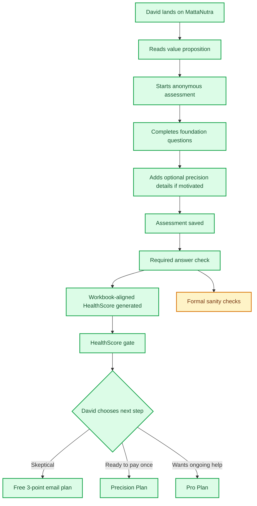
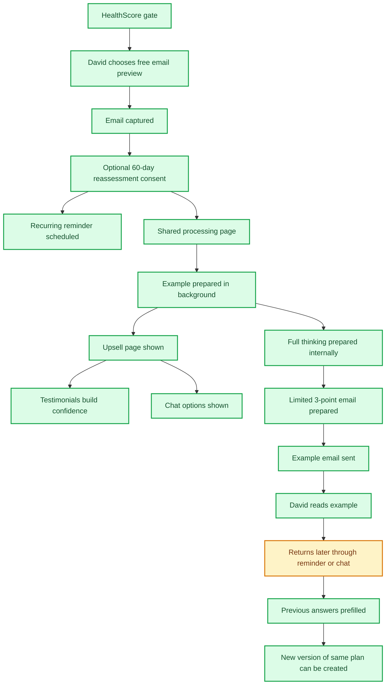
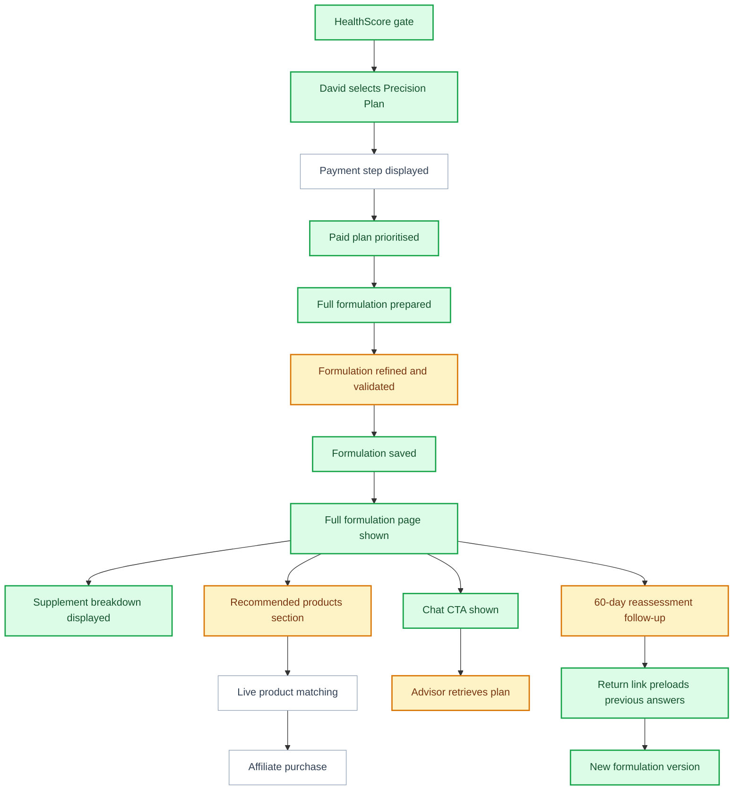
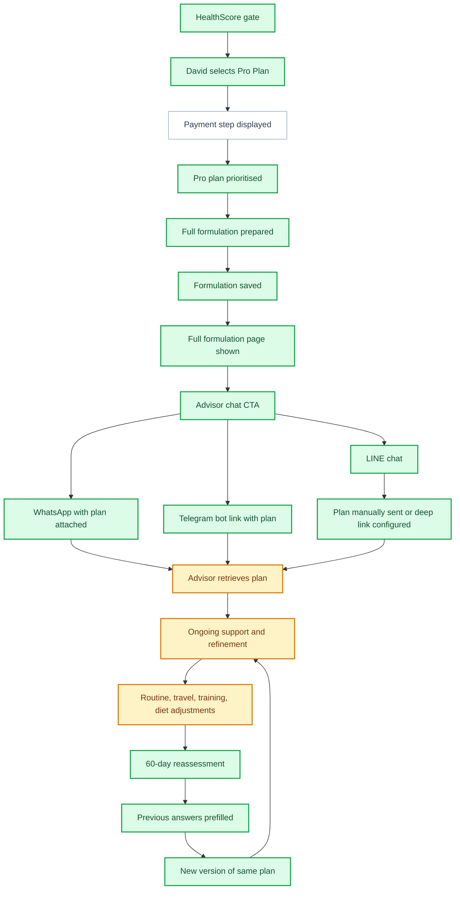

# User Experience and Business Process

This document maps one representative customer through the current MattaNutra journey. It is intended to help the business team refine the process, improve conversion, and identify where the product experience still has gaps.

## Status Legend

| Status | Meaning |
| --- | --- |
| Done | Working in the current product |
| Partial | Built in part, placeholder, or dependent on another unfinished process |
| Not Done | Not yet built or not live |

## Invented Customer

| Field | Detail |
| --- | --- |
| Name | David |
| Age | 52 |
| Profile | Male, based in Thailand, works long hours, exercises occasionally |
| Intent | Improve health, energy, and longevity without wasting money |
| Budget | Medium |
| Skepticism | Unsure whether supplements are worth it and wary of generic recommendations |
| Concerns | Evidence, safety, too many pills, hidden costs, whether product choices are trustworthy |
| Likely conversion trigger | A clear HealthScore, practical next steps, and proof that the plan is specific to him |
| Likely blocker | Being asked to pay before he understands the value or safety of the recommendation |

## David's Core Job Story

As a 52-year-old man, I want to improve my health and longevity, but I have a medium budget and I am skeptical of supplement value. I want to see whether MattaNutra can understand my situation, explain what matters most, and give me practical recommendations before I commit to a paid plan.

## Sales Funnel Reading of David

David is not a quick impulse buyer. He is likely to convert if the product reduces uncertainty step by step.

| Funnel Moment | David's Likely Thought | What Must Happen | Conversion Risk |
| --- | --- | --- | --- |
| Landing page | "This might be useful, but is it credible?" | Show personalisation, anonymity, and practical outcomes quickly | He leaves before starting |
| Assessment | "This is a lot of questions. Is it worth it?" | Keep progress visible and questions easy to answer | He abandons before the HealthScore |
| HealthScore | "Okay, it did understand something about me." | Show one or two specific insights from the spreadsheet-backed score model | The score feels accurate but not yet emotionally persuasive |
| Free preview | "I am not paying yet, but I will give an email." | Make the free plan feel useful and low-risk | He gives email but never returns |
| Precision | "I might pay once if this saves me research time." | Show clear one-time value and trusted product guidance | He delays because product trust is unclear |
| Pro | "I would subscribe only if this helps me day to day." | Make advisor use cases concrete | Pro feels like a vague upsell |
| Follow-up | "Has anything actually improved?" | Show score movement and revised next steps | Reassessment feels like marketing, not service |

## Experience Principles for This User

- Show value before asking for money.
- Make the assessment feel anonymous, respectful, and low-risk.
- Use the HealthScore to create a clear reason to continue.
- Explain why the formulation is specific to him.
- Keep safety and non-medical positioning visible but subtle.
- Give him an easy fallback if he is not ready to pay.
- Use follow-up and chat to keep the relationship alive after the first decision.

## HealthScore Basis

Implementation status: Done.

The HealthScore is now generated from the MattaNutra scoring workbook rather than a generic weighted estimate. It uses six domain point totals, scales the raw score against a 95-point maximum, and clamps the final display score between 8 and 96. The scoring formula has been checked against sampled workbook outcomes, making it consistent enough for business review and future reassessment comparisons.

For David, this matters because the number should feel like a structured summary of his assessment, not a decorative quiz result. The remaining experience challenge is to translate the score into one or two insights that make him want to continue.

## Happy Flow Overview

## Path 1: Free Preview Journey

David likes the HealthScore but is not yet convinced enough to pay. He chooses the free 3-point nutrition plan by email.

### User Intent

- "Show me something useful first."
- "Do not make me buy a full plan before I trust the system."
- "Let me decide later."

### Current Path

1. David completes the assessment.
2. His assessment is saved.
3. His HealthScore is generated.
4. He sees the plan gate and chooses the free email option.
5. He enters his email address.
6. He can include a free 60-day reassessment reminder.
7. The shared processing page appears.
8. MattaNutra prepares his example in the background.
9. David lands on an upsell page that says his example is being prepared.
10. The upsell page shows testimonial proof and chat options.
11. MattaNutra prepares the full thinking internally but sends only a limited 3-point example.
12. The email is sent and recorded.
13. If he opted in, a recurring 60-day reassessment reminder is scheduled.
14. The reminder link brings him back with previous answers prefilled.

### Free Preview Flow

### Conversion Opportunities

| Moment | What David Needs | Business Opportunity |
| --- | --- | --- |
| HealthScore gate | Proof the system has understood him | Show the strongest personal insight before the plan choice |
| Free email capture | Low-risk next step | Make the free plan feel valuable without giving away everything |
| Upsell page | Social proof and reassurance | Testimonials should address skepticism, age, budget, and practical results |
| Chat option | Easy human-like continuation | LINE, Telegram, and WhatsApp should carry or request the plan clearly |
| 60-day reminder | Reason to come back | Show score movement and "what changed" as the hook |

### Satisfaction Tune-Ups

- The free preview should feel complete enough to be generous: three specific actions, not three vague statements.
- The upsell should avoid sounding like "pay or lose access"; it should feel like "your full plan is ready if you want it."
- The email should include one clear next action and one reason to come back.
- The 60-day reminder should reference improvement, not just retaking the quiz.

### Gaps Affecting This Journey

- Formal impossible-value and high-risk sanity checks are only partial.
- Live advisor retrieval and conversation flow are not fully connected.
- LINE may not automatically carry the plan reference unless a configured deep link is added.
- The follow-up strategy after the free email is still light.

## Path 2: Precision Plan Journey

David sees enough value in the HealthScore and wants a full plan, but he does not want an ongoing subscription.

### User Intent

- "Give me the full recommendation once."
- "Make it specific to my age, body, goals, and constraints."
- "Keep it practical and not too expensive."

### Current Path

1. David completes the assessment.
2. His HealthScore is generated.
3. He selects Precision Plan.
4. The shared processing page appears.
5. His paid request is treated as higher priority than free examples.
6. The formulation is prepared, refined, saved, and displayed.
7. The results page shows the personalised nutritional formulation.
8. Product recommendation areas can render, but live product matching is not active.
9. Chat options are available from the formulation page.
10. The 60-day reassessment promise needs a reliable email/payment identity path to be fully automatic.

### Precision Flow

### Conversion Opportunities

| Moment | What David Needs | Business Opportunity |
| --- | --- | --- |
| Plan selection | Confidence the paid plan is better than the free email | Explain what the full plan unlocks in concrete terms |
| Payment step | Trust and low friction | Payment must feel familiar, local, and safe |
| Results page | Practical recommendations | Make dose, timing, expected benefit, and product form easy to scan |
| Product section | Confidence not to waste money | Product matching should emphasize coverage, quality, and value |
| Reassessment | Continued value after purchase | Show that the plan can improve as his answers change |

### Satisfaction Tune-Ups

- The formulation should read like practical guidance, not a dense supplement list.
- Every recommendation should answer: what it supports, how to use it, and why it fits David.
- Product guidance should be conservative and quality-led; a skeptical user will punish anything that feels like affiliate spam.
- The result page should make it easy to take action today, not just understand the plan.

### Gaps Affecting This Journey

- Payment collection is not active.
- Live product matching and affiliate purchase are not active.
- Hard safety stop rules and ingredient exclusions are partial.
- Precision reassessment follow-up needs a reliable email source if David did not use the free email path.

## Path 3: Pro Plan Journey

David wants ongoing support because he expects his routine, sleep, food, and training to change. He chooses Pro if the AI advisor feels useful and credible.

### User Intent

- "Help me adapt this to real life."
- "Tell me what to do when my sleep, travel, training, or diet changes."
- "Do not just give me a static supplement list."

### Current Path

1. David completes the assessment.
2. His HealthScore is generated.
3. He selects Pro Plan.
4. The shared processing page appears.
5. The formulation is generated and displayed.
6. The formulation page invites him to connect with the specialist AI supplement advisor.
7. WhatsApp can open with a plan message.
8. Telegram can carry the plan when configured as a bot link.
9. LINE currently may require the user to send the displayed plan manually unless a deeper LINE integration is configured.
10. Returning Pro users can be treated differently and may bypass the paywall when active access is known.

### Pro Flow

### Conversion Opportunities

| Moment | What David Needs | Business Opportunity |
| --- | --- | --- |
| Pro plan selection | A reason to subscribe instead of buying once | Show examples of daily advisor use, not just "AI agent included" |
| Chat CTA | Confidence the advisor knows his plan | Make plan linking invisible or very clear |
| First chat | Fast, specific help | Start with a tailored welcome using his HealthScore and formulation |
| Ongoing use | Habit support | Let the advisor adapt to meals, travel, sleep, workouts, and budget |
| Reassessment | Proof of improvement | Show score movement and revised priorities |

### Satisfaction Tune-Ups

- Pro should be sold around situations, not features: travel week, poor sleep, new workout block, restaurant meals, low-energy day.
- The first advisor message should make it obvious that the advisor knows David's plan.
- Pro should include proactive check-ins, otherwise the subscription may feel passive.
- The advisor should help reduce complexity, not introduce more tasks.

### Gaps Affecting This Journey

- Payment and subscription activation are not live.
- The live advisor retrieval workflow is not fully connected.
- LINE plan handoff needs a proper deep-link or bot flow.
- Pro support promise needs sharper business definition.

## Shared Journey Risks

| Risk | Why It Matters | Suggested Business Decision |
| --- | --- | --- |
| HealthScore does not feel valuable enough | Users may stop before plan selection | Decide which score insight is most persuasive for each user type |
| Free preview gives too little value | Skeptical users may ignore the email | Define exactly what the 3-point plan includes |
| Free preview gives too much value | Users may not upgrade | Keep full dose logic, product matching, and ongoing support paid |
| Payment is not local or trusted | Thai users may abandon | Decide payment provider and supported methods |
| Product recommendations lack trust | Users may not buy through marketplace links | Build quality signals into product cards |
| Advisor chat does not carry context | Pro value becomes unclear | Prioritize one channel first and make plan retrieval reliable |
| Safety rules are incomplete | Scaling creates risk | Finish stop conditions and hard exclusions before high traffic |

## Funnel Tuning Recommendations

| Funnel Stage | Recommended Change | Expected Benefit |
| --- | --- | --- |
| Landing page | Add one short proof point near the main CTA: anonymous, personalised, practical | More assessment starts |
| Assessment | Keep labels short and show progress without making the user feel examined | Higher completion |
| HealthScore | Lead with David's biggest opportunity and one achievable improvement | Stronger paid-plan intent |
| Plan choice | Make Free, Precision, and Pro feel like natural levels of support | Less confusion and better self-selection |
| Free email | Use the free plan to build trust and tee up one paid reason | Better lead-to-paid conversion |
| Precision | Emphasize research saved, specificity, and product confidence | Better one-time purchase conversion |
| Pro | Show concrete advisor use cases | Better subscription conversion |
| Results | Make the first action obvious | Higher satisfaction and lower refund risk |
| Follow-up | Send score-change framing, not generic marketing | More return assessments |

## Suggested Conversion Experiments

1. Test whether David converts better when the HealthScore page leads with his weakest domain or his biggest possible score improvement.
2. Test two free-preview offers: "3-point nutrition plan" versus "3 most important next steps".
3. Test whether showing a sample paid formulation section increases Precision conversion.
4. Test whether the Pro plan sells better as "AI supplement advisor" or "ongoing wellness refinement".
5. Test LINE-first chat placement for Thai users and WhatsApp-first placement for English users.
6. Test whether 60-day reassessment consent performs better before or after the free email button.
7. Test whether product quality proof belongs on the plan gate or only on the results page.

## Business Questions to Refine Next

- What exact moment should trigger payment: before formulation generation, after a teaser, or after partial formulation?
- Should every paid user provide an email before payment so reassessment follow-up is reliable?
- How much of the formulation should the free email reveal?
- After the free email has been requested or sent, where should the user go next and what components should that page include?
- Which one chat channel should be made excellent first?
- What proof will convince a skeptical 52-year-old that the plan is not generic?
- Should Pro include guaranteed human review for edge cases, or only AI advisor support?
- What does success look like after 60 days: higher HealthScore, repeat purchase, Pro upgrade, or chat engagement?
